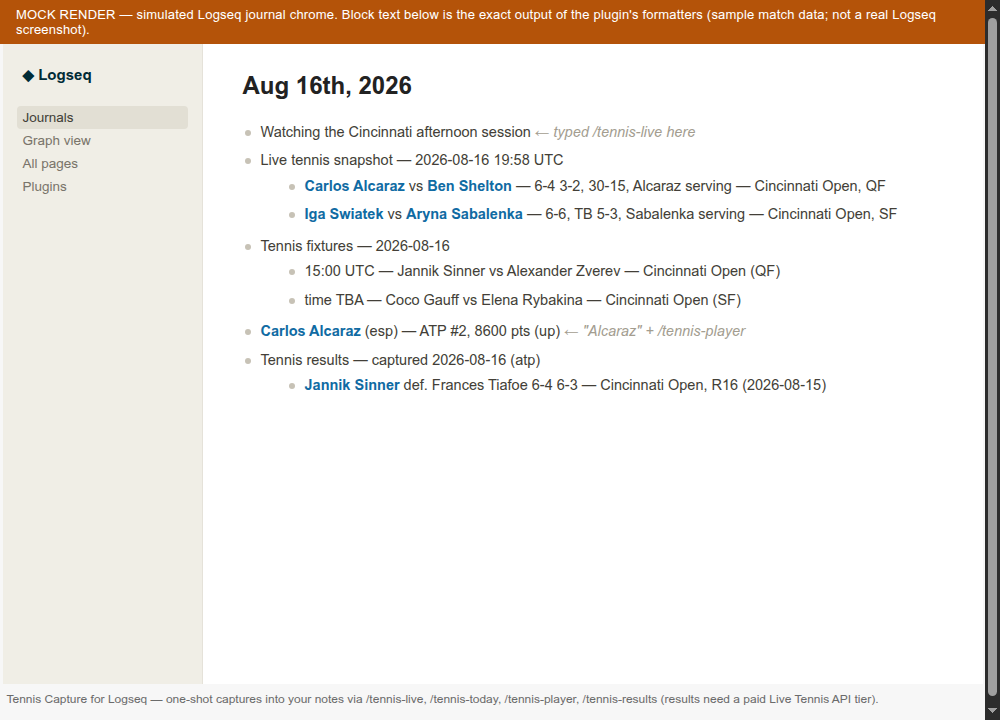

# Tennis Capture for Logseq

Capture tennis into your notes: today's fixtures, recent results, a player's
current ranking, or a timestamped snapshot of matches in play — inserted as
plain blocks in whatever page or journal you run the command in. Data comes
from the [Live Tennis API](https://livetennisapi.com) (ATP, WTA, Challenger,
ITF and junior Grand Slam draws).

This is a **capture tool, not a scoreboard**: every command is a one-shot
insert into your graph. Nothing polls, nothing auto-refreshes, and what you
capture stays yours as ordinary Logseq blocks.



*(Screenshot is a labeled mock render of the inserted blocks — exact command
output, simulated Logseq chrome.)*

## Commands

| Command | What it inserts |
|---|---|
| `/tennis-today` | Today's scheduled fixtures (UTC day) as a bullet list, with start times where the order of play has assigned them |
| `/tennis-results` | The most recent completed matches for your default tour, winner-first with set scores — **requires a paid tier** (see below) |
| `/tennis-player` | Type a player name in the block, run the command — the block becomes a player line with the current ranking, points and movement |
| `/tennis-live` | A one-shot, timestamped snapshot of matches currently in play (score, server, tiebreak/interruption markers) |

## Setup

1. Get an API key — the FREE tier is self-serve, no card:
   <https://livetennisapi.com/subscribe/free>
2. Open the plugin settings and paste the key; optionally pick a default tour
   (`atp`, `wta`, `challenger`, `itf`, `juniors`, or all).

### What the FREE tier covers (honestly)

- **Included:** live and upcoming matches, current scores, fixtures, player
  search and profiles, tournaments — i.e. `/tennis-today`, `/tennis-player`
  and `/tennis-live` work on a FREE key.
- **Limits:** 30 requests/minute, 100/day.
- **Not included:** completed-match history and head-to-head are paid
  (BASIC and up, or any [Historical Data plan](https://livetennisapi.com/historical-tennis-data-api)).
  `/tennis-results` on a FREE key shows a clear upgrade message rather than
  failing silently — the API returns `403 upgrade_required`, never an empty
  result.

The key is stored in plaintext in Logseq's plugin settings file. The API's
CORS policy explicitly allows browser-side use of a FREE key (it is capped
and revocable); keep paid keys out of shared graphs.

## File graphs and DB graphs

The plugin only uses `logseq.Editor` block APIs (`updateBlock`,
`insertBatchBlock`) and inserts plain text blocks, so it works on both
classic file graphs and the newer DB graphs.

## Development

```sh
npm install
npm test        # vitest unit tests (formatting + API client, mocked HTTP)
npm run build   # tsc --noEmit && vite build → dist/
```

Load the unpacked plugin: Logseq → Settings → Advanced → Developer mode →
Plugins → *Load unpacked plugin* → select this folder (after a build).

Releases are built by `.github/workflows/publish.yml`: pushing a tag builds
the plugin and attaches `logseq-live-tennis.zip` (dist + package.json + icon +
README + LICENSE) to the GitHub release.

## Disclosure

This plugin is maintained by the Live Tennis API team — we maintain the API
it uses.

## License

[MIT](./LICENSE)
